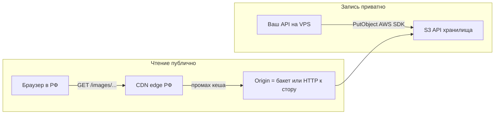

# Медиа для аудитории в РФ: объектное хранилище + CDN с российским edge

Этот документ — **пошаговый разбор «максимально быстро и предсказуемо для пользователей в России»**: сервер пишет файлы по **S3 API**, браузер читает по **HTTPS** через **CDN с точками присутствия в РФ/СНГ**.

Приложение уже рассчитано на любой S3-совместимый бэкенд: те же переменные, что в [cdn.md](cdn.md) и [IMAGES.md](IMAGES.md). Публичные ссылки строятся так:

```text
{MEDIA_PUBLIC_BASE_URL}/images/{sha256}/{ширина}w.{avif|webp|jpg}
```

**Важно:** `MEDIA_PUBLIC_BASE_URL` — это **ровно тот хост**, с которого пользователь качает картинку (обычно **домен CDN**), а не «внутренний» endpoint для загрузки с API.

---

## 1. Общая схема (что настраиваете вы)



1. **Бакет** в облаке с датацентрами в РФ (или рядом) — низкая задержка **от вашего сервера** до стореджа при `PutObject`.
2. **CDN** с **российскими точками** — низкая задержка **от пользователя** до первого байта картинки (и кеш на edge).
3. В `.env`: ключи и **endpoint для записи**; отдельно **`MEDIA_PUBLIC_BASE_URL`** = `https://img.ваш-домен.ru` (или выданный CDN-домен).

Выбор провайдера — коммерческий и юридический; ниже даны **типовые шаги**, которые совпадают по смыслу у Yandex Cloud, VK Cloud, Selectel и др. Точные названия кнопок смотрите в актуальной документации выбранного облака.

---

## 2. Переменные для этого проекта (напоминание)

| Переменная | Роль для «РФ-стека» |
|------------|---------------------|
| `MEDIA_S3_BUCKET` | Имя бакета в консоли облака. |
| `MEDIA_S3_ENDPOINT` | URL **S3 API** (не URL картинки в браузере). У каждого провайдера свой; у Yandex — `https://storage.yandexcloud.net`. |
| `MEDIA_S3_REGION` | Регион бакета, например `ru-central1` (Yandex). |
| `MEDIA_S3_FORCE_PATH_STYLE` | Для многих не-AWS S3 включите **`1`**, если загрузка с API падает с ошибкой виртуального хоста / signature. |
| `AWS_ACCESS_KEY_ID` / `AWS_SECRET_ACCESS_KEY` | Статический ключ доступа к API (аналог IAM в облаке провайдера). |
| `MEDIA_PUBLIC_BASE_URL` | **HTTPS без `/` в конце** — домен **CDN** (предпочтительно) или, для черновой проверки, публичный URL бакета (см. §6). |

Прод: удобно держать всё в `deploy/deploy.env` как `export …` и прогонять `./deploy/redeploy.sh` — см. [README.md](README.md).

---

## 3. Вариант «полный цикл» — Yandex Object Storage + Yandex CDN

Ниже — логика настройки; в интерфейсе Yandex Cloud шаги могут слегка меняться, но порядок всегда такой.

### Шаг 3.1. Регистрация и каталог

1. Заведите аккаунт в [Yandex Cloud](https://cloud.yandex.ru).
2. Создайте **облако** и **каталог** (folder), запомните **идентификатор каталога**, если понадобится для CLI (для этого гайда не обязателен).

### Шаг 3.2. Сервисный аккаунт и статический ключ доступа

Нужен ключ **именно для вашего API** (запись объектов в один бакет), не ваш личный пароль.

1. **IAM** → **Сервисные аккаунты** → создайте СА, например `mlaffon-media-uploader`.
2. Назначьте роли минимально достаточные для записи в Object Storage, например (названия уточняйте в документации):
   - роль вроде **`storage.editor`** на каталог **или** более узкая кастомная роль только на нужный бакет, если используете политики.
3. **Создайте статический ключ доступа** для этого СА (Access key ID + Secret). Секрет показывается один раз → сразу в менеджер секретов / `deploy/deploy.env` на сервере.

В `.env`:

- `AWS_ACCESS_KEY_ID` = идентификатор ключа  
- `AWS_SECRET_ACCESS_KEY` = секрет  

### Шаг 3.3. Бакет Object Storage

1. Раздел **Object Storage** → **Создать бакет**.
2. Имя, например `mlaffon-media-prod` → **`MEDIA_S3_BUCKET`**.
3. Регион **`ru-central1`** (или тот, где держите прод) → **`MEDIA_S3_REGION=ru-central1`**.
4. Класс хранилища и политика удаления — по бюджету; для картинок обычно стандартный класс.

### Шаг 3.4. Endpoint и стиль путей для AWS SDK в приложении

Для Yandex Object Storage S3-совместимый endpoint обычно:

```bash
MEDIA_S3_ENDPOINT=https://storage.yandexcloud.net
MEDIA_S3_REGION=ru-central1
```

Часто для совместимости с SDK задают:

```bash
MEDIA_S3_FORCE_PATH_STYLE=1
```

Если без `FORCE_PATH_STYLE` загрузка из API проходит — можно оставить выключенным; если появляются ошибки подписи или «виртуальный хост» — включите **`1`**.

### Шаг 3.5. Чтение объектов: только CDN (рекомендуется для прода)

Цель: бакет **не обязан** быть полностью публичным; на практике для статики делают так:

1. Включают **публичное чтение** для объектов, которые CDN забирает с origin **или** настраивают origin так, как описано в мастере CDN (у некоторых облаков CDN ходит к бакету «от имени платформы»).
2. Создают ресурс **Yandex Cloud CDN**:
   - **Источник (origin)** — ваш бакет / HTTPS к Object Storage (в мастере обычно есть пресет «Object Storage»).
   - Включите **HTTPS** на стороне CDN для пользовательского домена.
3. Включите **кеширование** для префикса `images/` (долгий TTL согласуется с тем, что в коде уже выставляется `Cache-Control: immutable` на объектах — CDN может уважать заголовки origin).

Итоговый адрес вида **`https://img.ваш-сайт.ru`** (после привязки своего домена) — это и есть **`MEDIA_PUBLIC_BASE_URL`**.

**Не путать:**

- Запись: `storage.yandexcloud.net` + ключи (внутренний S3 API).
- Чтение в браузере: `https://img.ваш-сайт.ru/...` (CDN).

### Шаг 3.6. Свой поддомен на CDN

1. В консоли CDN добавьте **дополнительный домен** (например `img.example.ru`).
2. В DNS у регистратора (или в DNS Yandex / другом хостинге) создайте **CNAME** для `img` на имя, которое покажет мастер CDN (типично что-то вроде `...clouddns.ru` / edge hostname — **копируйте из консоли**).
3. Дождитесь выпуска TLS-сертификата (Let’s Encrypt / встроенный в облаке).

Проверка:

```bash
curl -I "https://img.example.ru/images/test/320w.jpg"
```

(после того как появится реальный объект с таким ключом).

### Шаг 3.7. Пример блока для `deploy/deploy.env`

```bash
export MEDIA_S3_BUCKET=mlaffon-media-prod
export MEDIA_S3_ENDPOINT=https://storage.yandexcloud.net
export MEDIA_S3_REGION=ru-central1
export MEDIA_S3_FORCE_PATH_STYLE=1
export MEDIA_PUBLIC_BASE_URL=https://img.example.ru
export AWS_ACCESS_KEY_ID=YC...
export AWS_SECRET_ACCESS_KEY=...
```

Далее на сервере: `./deploy/redeploy.sh` и проверка загрузки через админку или [IMAGES.md](IMAGES.md).

---

## 4. Другие облака РФ (VK Cloud, Selectel, Timeweb Cloud и т.д.)

Принцип **тот же**, меняются только hostname и инструкции по CDN.

### 4.1. Что найти в документации провайдера

1. **S3 endpoint** — один хост для API (примерно как `storage.yandexcloud.net`, но свой).
2. **Регион** — строка региона для SDK (если неизвестна, часто подсказывают в примере `aws s3 ls --endpoint-url=...`).
3. **Создание бакета и ключей** — аналог IAM / статического ключа.
4. **CDN** с **российским edge** — создать ресурс, origin = бакет или публичный HTTP к бакету, подключить домен `img.*`.

### 4.2. Подстановка в переменные

```bash
export MEDIA_S3_BUCKET=<имя_бакета>
export MEDIA_S3_ENDPOINT=<https://s3.... из документации>
export MEDIA_S3_REGION=<регион_из_документации_или_us-east-1_заглушка>
export MEDIA_S3_FORCE_PATH_STYLE=1   # начните с этого при не-AWS
export MEDIA_PUBLIC_BASE_URL=https://img.ваш-домен.ru
export AWS_ACCESS_KEY_ID=...
export AWS_SECRET_ACCESS_KEY=...
```

Если провайдер даёт **два URL** — «для API» и «публичный для объектов» — в **`MEDIA_S3_ENDPOINT`** всегда **API**, а **`MEDIA_PUBLIC_BASE_URL`** — **тот, что открывается в браузере** (почти всегда CDN).

---

## 5. Свой сервер: MinIO (или аналог) в РФ + CDN перед ним

Имеет смысл, если хотите полный контроль и уже есть площадка в российском ДЦ.

1. Поднимаете **MinIO** на VPS (HTTPS за **Caddy** / nginx).
2. Создаёте бакет, пользователя, ключи.
3. **`MEDIA_S3_ENDPOINT`** = `https://minio-api.ваш-домен.ru` (только API, не консоль).
4. **`MEDIA_S3_FORCE_PATH_STYLE=1`** почти всегда.
5. Публично раздавать объекты напрямую с MinIO в проде не обязательно: лучше **CDN** с origin на публичный HTTP(S) бакета или на nginx, который проксирует GET по пути `/images/...`.

**`MEDIA_PUBLIC_BASE_URL`** в любом случае = тот хост, где пользователь делает GET (CDN или аккуратно настроенный публичный URL).

---

## 6. Черновая проверка без CDN (только для отладки)

Если бакет отдаёт объекты по публичному HTTPS без CDN, для Yandex формат обычно:

```text
https://storage.yandexcloud.net/<имя_бакета>/<ключ>
```

Тогда можно временно задать:

```bash
MEDIA_PUBLIC_BASE_URL=https://storage.yandexcloud.net/<имя_бакета>
```

и ссылка на файл станет, например:

`https://storage.yandexcloud.net/<имя_бакета>/images/<hash>/320w.avif`

**Для прода** лучше перейти на CDN: меньше нагрузка на origin, стабильнее latency для пользователей по стране.

---

## 7. Безопасность и минимальные права

1. Ключ с доступом **только к одному бакету** (или префиксу), без лишних ролей в облаке.
2. Секреты **только** на сервере API (`deploy/deploy.env`, `apps/api/.env`), не в git.
3. Разделяйте **стейдж** и **прод** разными бакетами и ключами.
4. Если CDN поддерживает **ограничение по Referer** или WAF — включайте осмысленно (учтите Telegram WebView и прямые ссылки).

---

## 8. Проверка «всё ли быстро и правильно»

1. **Загрузка с API:** админка или `POST .../api/admin/media/images` — ответ без ошибки, в бакете появляются ключи `images/<hash>/...`.
2. **GET из РФ:** откройте `fallbackSrc` из ответа в браузере; статус 200, корректный `Content-Type`.
3. **CDN:** заголовки ответа должны содержать признаки edge (имена заголовков зависят от провайдера). Повторный запрос быстрее за счёт кеша.
4. Внешние замеры: WebPageTest с локации **Moscow / Novosibirsk**, Lighthouse на реальном устройстве.

---

## 9. Типичные проблемы

| Симптом | Что сделать |
|---------|-------------|
| Ошибка SDK при `PutObject` | Проверить `MEDIA_S3_ENDPOINT`, регион, ключи; выставить `MEDIA_S3_FORCE_PATH_STYLE=1`. |
| Объект есть, по CDN404 | Неверный origin / префикс в CDN; путь в бакете должен начинаться с `images/`. |
| Объект есть, 403 по CDN | Нет прав на чтение с origin; политика бакета; не тот домен. |
| В HTML «чужой» домен | `MEDIA_PUBLIC_BASE_URL` не совпадает с тем URL, который реально открывается пользователю. |
| Медленно из РФ при зарубежном origin | Перенесите бакет и CDN в облако с РФ-датацентрами или смените CDN на сеть с российским edge. |

---

## 10. Связанные файлы в репозитории

- [cdn.md](cdn.md) — R2, AWS, MinIO, общий чеклист.
- [IMAGES.md](IMAGES.md) — HTTP API, `curl`, скрипт загрузки.
- [deploy.env.example](deploy.env.example) — шаблон переменных для redeploy.

Код клиента S3: `apps/api/src/services/mediaConfig.ts` (`forcePathStyle` включается переменной `MEDIA_S3_FORCE_PATH_STYLE=1`).
