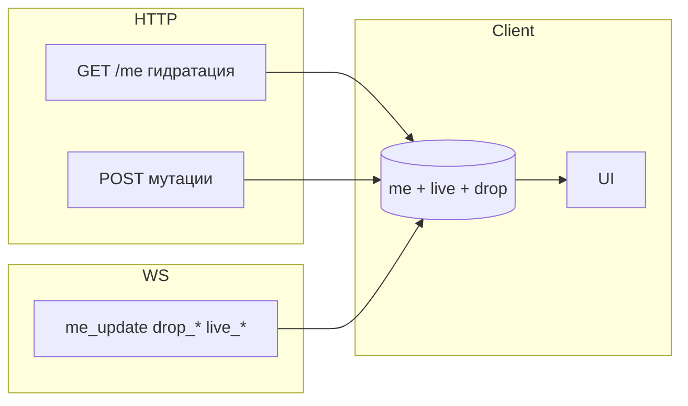

# Аудит HTTP + WebSocket: `apps/web` ↔ `/api/v1/**`

**Область:** `apps/web/src/**/*`, маршруты API `GET/POST/... /api/v1/**`, WebSocket **`/api/v1/ws`**.  
**Актуальность:** по коду репозитория; связанный план развития: [REALTIME_ARCHITECTURE_PLAN.md](./REALTIME_ARCHITECTURE_PLAN.md).  
**Пошаговый рефакторинг для Cursor-агента:** [CURSOR_REFACTOR_TZ.md](./CURSOR_REFACTOR_TZ.md).

**Примечание по именам файлов:** в ТЗ упоминался `useBalanceWebSocket.ts` — в коде используется **`hooks/useRealtimeWebSocket.ts`** (`/api/v1/ws`).

---

## 1. Карта вызовов (машиночитаемый формат)

Ниже — сжатые записи; `frequency` для таймеров — при **видимой вкладке** (`document.visibilityState === "visible"`).

```json
{ "route": "/api/v1/me", "method": "GET", "callers": ["App.tsx"], "triggers": ["bootstrap_with_token", "interval", "visibility_resume", "manual_onRefresh"], "frequency": "30s без WS / 120s с WS; +ручные вызовы", "canBeOptimized": true }
```

```json
{ "route": "/api/v1/ws", "method": "WebSocket", "callers": ["hooks/useRealtimeWebSocket.ts"], "triggers": ["AppShell mounted, enabled"], "frequency": "постоянное соединение", "canBeOptimized": false }
```

```json
{ "route": "/api/v1/drops/active", "method": "GET", "callers": ["App.tsx loadDrop"], "triggers": ["onOpen WS", "drop_started handler", "visibility_resume", "interval только если WS отключён", "openDrop", "dropOpen effect"], "frequency": "без WS: 8s при активном дропе и не won, иначе 30s; с WS: без интервала", "canBeOptimized": true }
```

```json
{ "route": "/api/v1/drops/attempt", "method": "POST", "callers": ["components/DropOverlay.tsx"], "triggers": ["user submits code"], "frequency": "manual", "canBeOptimized": false }
```

```json
{ "route": "/api/v1/home/public", "method": "GET", "callers": ["pages/Home.tsx"], "triggers": ["mount"], "frequency": "once per Home mount", "canBeOptimized": true }
```

```json
{ "route": "/api/v1/live-broadcast", "method": "GET", "callers": ["store/liveBroadcastStore.ts hydrateFromApi", "pages/Home.tsx interval"], "triggers": ["AppShell mount + visibility + WS onOpen/reconnect", "Home: 45s при WS / 5s или 20s без WS"], "frequency": "см. §4", "canBeOptimized": true }
```

```json
{ "route": "/api/v1/live-broadcast/watch", "method": "POST", "callers": ["pages/Home.tsx"], "triggers": ["watch button"], "frequency": "manual", "canBeOptimized": false }
```

```json
{ "route": "/api/v1/promo/apply", "method": "POST", "callers": ["pages/Home.tsx"], "triggers": ["apply promo"], "frequency": "manual", "canBeOptimized": true }
```

```json
{ "route": "/api/v1/tasks", "method": "GET", "callers": ["pages/Tasks.tsx"], "triggers": ["mount", "activePlatform change"], "frequency": "on load", "canBeOptimized": false }
```

```json
{ "route": "/api/v1/tasks/:id/claim", "method": "POST", "callers": ["pages/Tasks.tsx"], "triggers": ["claim"], "frequency": "manual", "canBeOptimized": false }
```

```json
{ "route": "/api/v1/games/fortune", "method": "GET", "callers": ["pages/Games.tsx"], "triggers": ["mount"], "frequency": "once", "canBeOptimized": false }
```

```json
{ "route": "/api/v1/games/fortune/spin", "method": "POST", "callers": ["pages/Games.tsx"], "triggers": ["spin"], "frequency": "manual", "canBeOptimized": false }
```

```json
{ "route": "/api/v1/shop/items", "method": "GET", "callers": ["pages/Shop.tsx"], "triggers": ["mount"], "frequency": "once", "canBeOptimized": false }
```

```json
{ "route": "/api/v1/shop/purchase", "method": "POST", "callers": ["pages/Shop.tsx"], "triggers": ["buy"], "frequency": "manual", "canBeOptimized": false }
```

```json
{ "route": "/api/v1/leaderboard", "method": "GET", "callers": ["pages/Leaderboard.tsx"], "triggers": ["mount", "filters"], "frequency": "per visit", "canBeOptimized": true }
```

```json
{ "route": "/api/v1/referrals", "method": "GET", "callers": ["pages/Profile.tsx"], "triggers": ["mount"], "frequency": "once", "canBeOptimized": false }
```

```json
{ "route": "/api/v1/giveaways", "method": "GET", "callers": ["pages/Giveaways.tsx"], "triggers": ["mount"], "frequency": "once", "canBeOptimized": false }
```

```json
{ "route": "/api/v1/giveaways/:id", "method": "GET", "callers": ["pages/Giveaway.tsx"], "triggers": ["mount, id change"], "frequency": "per screen", "canBeOptimized": false }
```

```json
{ "route": "/api/v1/giveaways/:id/join", "method": "POST", "callers": ["pages/Giveaway.tsx"], "triggers": ["join"], "frequency": "manual", "canBeOptimized": false }
```

```json
{ "route": "/api/v1/oauth/:platform/url", "method": "GET", "callers": ["hooks/useOAuthLink.ts"], "triggers": ["OAuth start"], "frequency": "manual", "canBeOptimized": false }
```

```json
{ "route": "/api/v1/platforms/:platform/connect", "method": "POST", "callers": ["hooks/useOAuthLink.ts"], "triggers": ["dev stub"], "frequency": "rare", "canBeOptimized": false }
```

```json
{ "route": "/api/v1/platforms/:platform", "method": "DELETE", "callers": ["pages/Profile.tsx"], "triggers": ["disconnect"], "frequency": "manual", "canBeOptimized": false }
```

```json
{ "route": "/api/v1/account/delete", "method": "POST", "callers": ["pages/Profile.tsx"], "triggers": ["delete account"], "frequency": "manual", "canBeOptimized": false }
```

```json
{ "route": "/api/v1/ban-appeal", "method": "POST", "callers": ["pages/BannedScreen.tsx"], "triggers": ["appeal submit"], "frequency": "manual", "canBeOptimized": false }
```

```json
{ "route": "/api/v1/auth/telegram", "method": "POST", "callers": ["api.ts"], "triggers": ["bootstrap"], "frequency": "once", "canBeOptimized": false }
```

```json
{ "route": "/api/v1/auth/dev", "method": "POST", "callers": ["api.ts"], "triggers": ["bootstrap dev"], "frequency": "once", "canBeOptimized": false }
```

---

## 2. Таблица всех HTTP-вызовов (сводка)

| Метод | Путь | Источник | Триггеры |
|-------|------|----------|----------|
| GET | `/api/v1/me` | `App.tsx` | Старт, интервал, возврат вкладки, `onRefresh` из экранов |
| WS | `/api/v1/ws?token=` | `useRealtimeWebSocket.ts` | Постоянно при `AppShell` |
| GET | `/api/v1/drops/active` | `App.tsx` | См. §4 |
| POST | `/api/v1/drops/attempt` | `DropOverlay.tsx` | Ввод кода |
| GET | `/api/v1/home/public` | `Home.tsx` | Mount главной |
| GET | `/api/v1/live-broadcast` | `Home.tsx` | См. §4 |
| POST | `/api/v1/live-broadcast/watch` | `Home.tsx` | «Смотреть стрим» |
| POST | `/api/v1/promo/apply` | `Home.tsx` | Промокод |
| GET | `/api/v1/tasks?platform=` | `Tasks.tsx` | Mount / смена платформы |
| POST | `/api/v1/tasks/:id/claim` | `Tasks.tsx` | Клейм |
| GET/POST | `/api/v1/games/fortune*` | `Games.tsx` | Экран / спин |
| GET/POST | `/api/v1/shop/*` | `Shop.tsx` | Список / покупка |
| GET | `/api/v1/leaderboard` | `Leaderboard.tsx` | Таблица лидеров |
| GET | `/api/v1/referrals` | `Profile.tsx` | Рефералы |
| GET/POST | `/api/v1/giveaways*` | `Giveaways.tsx`, `Giveaway.tsx` | Списки / деталь / join |
| OAuth / platforms | см. выше | `useOAuthLink`, `Profile` | OAuth и отвязка |
| POST | `/api/v1/ban-appeal` | `BannedScreen.tsx` | Апелляция |
| POST | `/api/v1/auth/*` | `api.ts` | Логин |

**Профиль:** отдельный `GET /leaderboard` для ранга **убран** — ранг берётся из **`me.leaderboardRankCoins`** (сервер включает в `/me`).

---

## 3. Дублирующие и пересекающиеся вызовы

| Проблема | Где | Деталь |
|----------|-----|--------|
| `GET /me` + таймер + пост-действия | `App.tsx`, `Home`, `Tasks`, … | После `watch`, клейма таски, OAuth-тоста — `onRefresh()` может совпасть с тиком интервала → два `/me` подряд. |
| `loadLive` + события | `Home.tsx` | Интервал + `mlaffon-live` + focus/visibility — намеренно для отзывчивости; риск кратковременных дублей подряд. |
| `balance_updated` → `refreshMe` | `useRealtimeWebSocket` | Legacy-путь; при наличии `me_update` избыточен. |
| Дроп: `loadDrop` при `drop_started` и `onOpen` | `App.tsx` | Один лишний GET при reconnect допустим как синк. |

---

## 4. Polling (`setInterval`)

| Где | Интервал | Условия остановки |
|-----|----------|-------------------|
| `App.tsx` | `/me`: 30s или 120s | `needsPlatformLink`, `!docVisible` — таймер снимается |
| `App.tsx` | `/drops/active`: 8s / 30s | **Нет интервала**, если `realtimeConnected`; иначе см. код |
| `Home.tsx` | `/live-broadcast`: **45s** при подключённом WS; **5s / 20s** без WS (active / не active) | Маршрут `/` и **видимая вкладка** |

**Обнаружено:**

- При **стабильном WS** эфир обновляется из **`live_started` / `live_ended`** в Zustand-store; периодический GET — редкий safety-net (~45s), не 5s.
- **`/drops/active`** при отсутствии WS всё ещё периодический (fallback) — при живом WS интервал отключён.
- Таймеры **`/me`** учитывают `docVisible` (интервал не крутится в фоне).

---

## 5. WebSocket-аудит

**Клиент:** `useRealtimeWebSocket.ts` → `ws(s)://host/api/v1/ws?token=JWT`.

**Обрабатываемые типы сообщений:**

| `type` | Действие на клиенте |
|--------|---------------------|
| `me_update` | `patchMe` — мерж `MeEconomyPatch` в `me` |
| `drop_started` | `loadDrop()` — один GET снапшота |
| `drop_finished` | Локальный сброс снапшота / закрытие оверлея |
| `drop_claimed` | Обновление `won` / `rewardCoins` |
| `live_started` / `live_ended` | `liveBroadcastStore` (Zustand) + `CustomEvent("mlaffon-live")` |
| `balance_updated` | Игнор (экономика через `me_update`) |

**Пробелы / техдолг:**

- Редкий **`GET /live-broadcast`** остаётся как safety и при reconnect/onOpen.
- Дроп при `drop_started` не передаёт полный снапшот в теле WS — нужен HTTP round-trip (осознанный компромисс).
- Reconnect: экспоненциальный backoff в `useRealtimeWebSocket` (до ~60s).

---

## 6. Data flow (ресурсы)

| Ресурс | Источник правды | Обновление |
|--------|-----------------|------------|
| `me` (экономика, ранг) | `GET /me` + мерж | `me_update` WS, `patchMe`, `refreshMe` |
| Дроп (UI) | `GET /drops/active` + локальный state | `drop_*` WS, таймер UI по `endsAt` |
| Эфир | `GET /live-broadcast` + store | WS `live_*` + `hydrateFromApi`, интервал см. §4 |
| Публичная главная | `GET /home/public` | Только mount |
| Таблица лидеров | `GET /leaderboard` | Экран «Топ» |
| Рефералы | `GET /referrals` | Профиль |

**Single source of truth:** для баланса/уровня — стремление к **`me` + `me_update`**; эфир и дроп всё ещё смешивают HTTP и события.

---

## 7. Race conditions (риски)

1. **`refreshMe`** — дедупликация параллельных вызовов через общий in-flight Promise в `App.tsx`.
2. **`watchLive`:** при `realtimeWsConnected` полный **`GET /me` не вызывается** — `patchMe` + `me_update` с сервера.
3. **Таски:** при успешном sync claim и `wsConnected` **`onRefresh` не вызывается** (баланс через `me_update`).

---

## 8. Оценка нагрузки (приблизительно)

**Условия:** пользователь на **`/`** (Home смонтирован), вкладка видима, эфир **активен**.

| Режим | `/me` / мин | `/drops/active` / мин | `/live-broadcast` / мин | Сумма GET (таймеры + типичный live poll) |
|-------|-------------|-------------------------|---------------------------|------------------------------------------|
| **WS подключён** | ~0.5 (120s) | ~0 (нет интервала) | ~1.3 (45s safety) | **~2** |
| **WS нет** | ~2 (30s) | ~7.5 (8s при активном дропе) или ~2 (30s) | ~12 (5s при active эфире) | **~21–27** |

Если эфир **не** активен и WS есть: `/live-broadcast` ~1.3/мин (45s). Без WS и без эфира: ~3/мин (20s).  
Плюс разовые `refreshMe` после действий и синк при возврате вкладки.

**Worst-case (без WS, активный дроп, эфир, главная):** порядка **25–30 GET/мин** только периодикой + ручные вызовы.

---

## 9. Избыточные / кандидаты на сокращение маршрутов

| Маршрут | Статус |
|---------|--------|
| `GET /drops/active` | Нельзя удалить полностью — нужен fallback и синк после `drop_started`; можно снижать частоту (уже сделано при WS). |
| `GET /live-broadcast` | Состояние эфира в **`liveBroadcastStore`** + WS; polling снижен (см. §4). |
| `GET /me` | Полный профиль нужен реже, если все экономические изменения идут через **`me_update`** + точечные POST ответы. |
| `GET /leaderboard` на профиле | Уже заменено рангом в **`/me`**. |

---

## 10. Проблемы по серьёзности

| Уровень | Проблема |
|---------|----------|
| **High** | (снято) Раньше: частый **`/live-broadcast`** — см. Zustand + 45s при WS. |
| **Medium** | (снято) Раньше: **`balance_updated` → refreshMe** — клиент игнорирует `balance_updated`. |
| **Medium** | (снято) Раньше: dedupe **`refreshMe`** — in-flight Promise в `App`. |
| **Medium** | (снято) Раньше: **`Tasks`** после sync claim — `onRefresh` только без WS. |
| **Low** | (снято) Reconnect backoff в **`useRealtimeWebSocket`**. |
| **Low** | `Home`: при WS `focus`/`viewport` не дергают GET (только без WS). |

---

## 11. Рекомендации (actionable)

```json
{
  "problem": "Polling live-broadcast каждые 5s на главной",
  "impact": "high",
  "solution": "Передавать в WS полный снимок эфира в live_started/live_ended; хранить в React context; оставить GET только при mount и reconnect.",
  "expectedGain": "с ~12 до ~0–2 req/min на эфир при активном стриме"
}
```

```json
{
  "problem": "balance_updated вызывает полный refreshMe",
  "impact": "medium",
  "solution": "На сервере слать только me_update; удалить или не эмитить balance_updated для новых клиентов.",
  "expectedGain": "меньше полных /me при каждом изменении баланса"
}
```

```json
{
  "problem": "Дубли refreshMe",
  "impact": "medium",
  "solution": "Очередь/AbortController или dedupe по promise (последний wins с отменой предыдущего).",
  "expectedGain": "меньше гонок и лишних GET"
}
```

```json
{
  "problem": "watchLive делает patchMe и onRefresh",
  "impact": "low",
  "solution": "Оставить patchMe для стрика; onRefresh убрать если POST watch возвращает дельту или приходит me_update.",
  "expectedGain": "−1 GET /me на каждый watch"
}
```

```json
{
  "problem": "Централизация состояния",
  "impact": "medium",
  "solution": "Лёгкий store (Zustand) для me + live + drop snapshot — уменьшить prop drilling и разнобой между App и Home.",
  "expectedGain": "проще сопровождать event-driven поток"
}
```

---

## 12. Целевая архитектура (кратко)



**События WS (целевой набор уже в основном реализован):** `me_update`, `drop_started`, `drop_finished`, `drop_claimed`, `live_started`, `live_ended`.

**Убрать polling:** для дропов — при WS; для эфира — **`live_*` в store** + редкий GET (45s safety).

---

## 13. Оценка «было → стало» (ориентир)

| Метрика | Было (старый аудит: всегда 8s дроп + 60s me) | Сейчас (код) | Цель после доработок эфира/legacy WS |
|---------|---------------------------------------------|--------------|-------------------------------------|
| GET/мин на главной с WS | ~20+ | **~2** (оценка §8) | **меньше 5** — достигнуто по таймерам |

---

## 14. Чеклист при изменениях

- [ ] Новый экран добавляет `setInterval` без `docVisible`?
- [ ] Мутация дублирует данные, которые придут в `me_update`?
- [ ] Нужен ли полный `refreshMe`, если есть WS-патч?
- [ ] Fallback при обрыве WS увеличивает интервалы?

---

## 15. Индекс файлов

| Назначение | Путь |
|------------|------|
| HTTP | `apps/web/src/api.ts` |
| Сессия, `me`, таймеры, дроп | `apps/web/src/App.tsx` |
| WS | `apps/web/src/hooks/useRealtimeWebSocket.ts` |
| Главная | `apps/web/src/pages/Home.tsx` |
| Эфир (Zustand) | `apps/web/src/store/liveBroadcastStore.ts` |
| Дроп UI | `apps/web/src/components/DropOverlay.tsx` |
| API сервер | `apps/api/src/index.ts`, `routes/*.ts` |

---

*Обновляйте документ при смене интервалов, новых маршрутах или контракте WS.*
